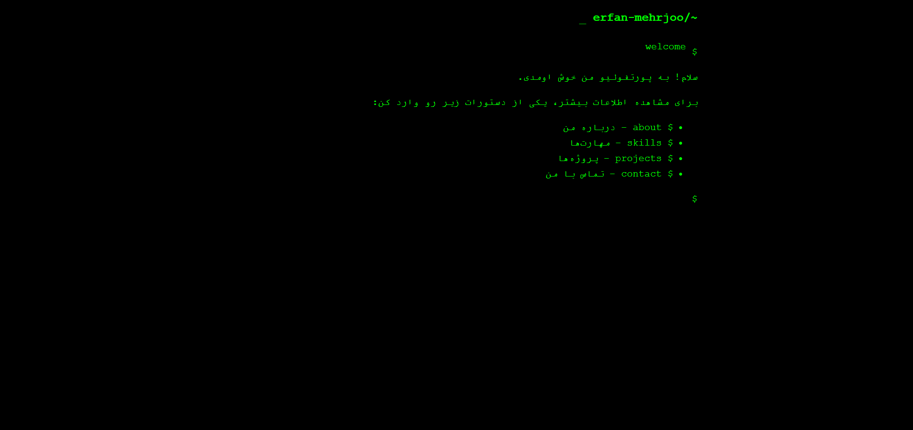

# پورتفولیو آنلاین - عرفان مهرجو

 <!-- اگه عکس از پروژه داری، اینجا قرار بده -->

این پروژه یه **پورتفولیو آنلاین** با تم **ترمینال‌گونه** هست که با استفاده از HTML, CSS و JavaScript ساخته شده. هدف این پروژه نمایش مهارت‌ها، پروژه‌ها و اطلاعات تماس من (عرفان مهرجو) به صورت جذاب و تعاملی به بازدیدکننده‌هاست.

---

## ویژگی‌های کلیدی

- **تم ترمینال‌گونه:** طراحی شبیه به یه ترمینال کامپیوتری با حس نوستالژیک و حرفه‌ای.
- **تعامل با کاربر:** کاربران می‌تونن با تایپ دستورات ساده به بخش‌های مختلف دسترسی داشته باشن.
- **نمایش پروژه‌ها:** هر پروژه به صورت یه کارت زیبا نمایش داده می‌شه که شامل عکس، عنوان، توضیحات و لینک به پروژه هست.
- **واکنش‌گرا (Responsive):** سایت روی دستگاه‌های مختلف (موبایل، تبلت، دسکتاپ) به خوبی نمایش داده می‌شه.

---

## بخش‌های اصلی

1. **درباره من (`about`):** یه معرفی کوتاه از من و تخصص‌هام.
2. **مهارت‌ها (`skills`):** لیستی از مهارت‌ها و تکنولوژی‌هایی که باهاشون کار کردم.
3. **پروژه‌ها (`projects`):** نمایش پروژه‌های انجام‌شده به صورت کارت‌های زیبا با جزئیات کامل.
4. **تماس با من (`contact`):** راه‌های ارتباطی مثل ایمیل، گیت‌هاب و لینکدین.

---

## تکنولوژی‌های استفاده‌شده

- **HTML**: برای ساختار سایت.
- **CSS**: برای استایل‌دهی و طراحی ظاهری.
- **JavaScript**: برای تعاملات و افکت‌های دینامیک.

---

